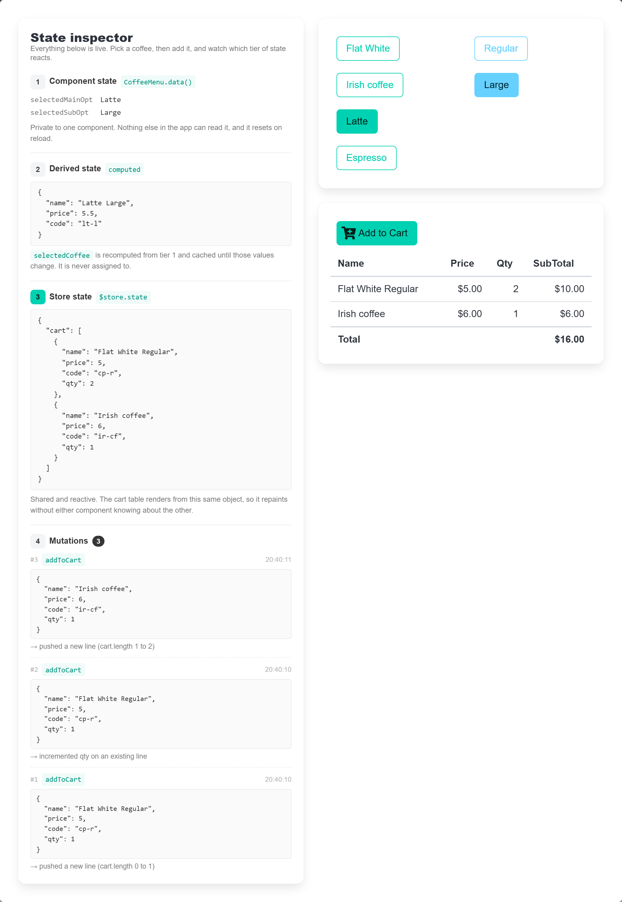

# Vue - Coffee Shopping Cart

> vue + vuex

[](https://v2.vuejs.org/)
[](https://v3.vuex.vuejs.org/)
[](https://vite.dev/)
[](https://bulma.io/)

[](https://opensource.org/license/isc-license-txt)
[](https://github.com/yangke-nz/vue-coffee-menu)

A simple vuex demo



## Installation

```sh
npm install
npm run serve
```
